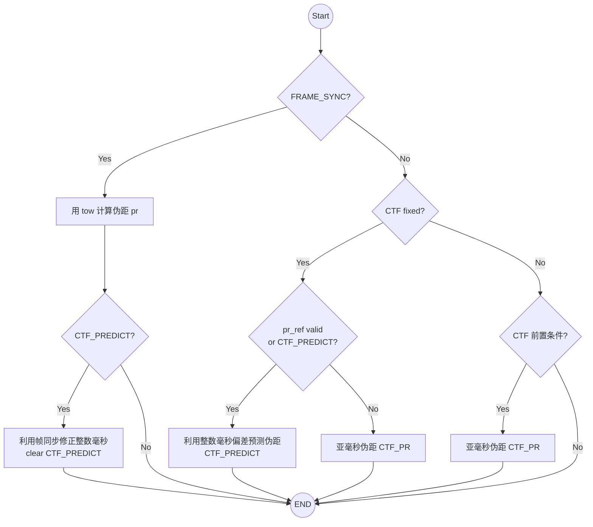

*——之前写过一篇介绍粗时导航的推文，[《粗时导航五状态方程理论与应用》](https://hqz.is-a.dev/articles/coarse-time-five-state-equation/)，从数学公式出发介绍了其理论模型与定位原理。
在后来的接收机工作实践中，我发现还有一些细节没有在文章中提及，或者说没有讲清楚。于是我准备从实践中遇到的问题触发，重新介绍一下粗时导航。*

# 1. 粗时导航与单点定位

一起回溯一下接收机从冷启动开始获取时间的流程，对比粗时导航与常规的单点定位的区别：

## 1.1 单点定位 SPP(Standalone Point Positioning)

- 首先逐个卫星获取卫星发射时间 $T_{tx}$, 通过帧同步 Frame Sync，获取 Bit 级别精度的周内时 TOW（Time of Week）
- 初始化接收机时间 $T_{rx}$
- 计算伪距 $Pr = T_{rx} - T_{tx}$
- 通过 LSQ 解算接收机钟差 CB ，修正得到精确的 $T_{rx}$

## 1.2 粗时导航 CTN(Coarse Time Navigation)

- 基于概略时间、概略位置和星历数据的辅助，通过卫星间的几何关系构建初始 $Pr$
- 引入第五个状态量粗时间误差 $\Delta T$，通过 LSQ 解算 CB 和 $\Delta T$，修正 $T_{rx}$。
- 需要注意，CTN Fix 修正后的 $T_{rx}$ 以及 $T_{tx}$ 大概率仍然是有偏的（毫秒量级）。

## 1.3 CTN 后的接收机时间仍有毫秒量级的误差

- 由于参数耦合等原因，CTF 的粗时误差参数解算的精度可能在毫秒级别（相关论文指出，可达到 1~100 ms）。因此即便修正了粗时误差，也不建议把接收机时间用于比特级别的辅助操作。
- 粗时导航通过约束不同卫星之间的相对位置关系，来实现快速定位。它实现了伪距的精确估计，但接收机时间和卫星发射时间可能存在整数毫秒量级的误差。
    - 考虑卫星速度 <1 KM/s，发射时刻差了几毫秒，对卫星位置的影响仅在米级，不会影响五状态方程收敛。
- 对于常规的单点定位四状态方程，需要保证 $T_{tx}$ 的准确性，因为卫星位置的误差会直接影响到定位结果。因此，**在从粗时导航到单点定位的过渡过程中，需要有一个机制来修正 $T_{tx}$**。

在进一步讨论如何修正 $T_{tx}$ 之前，我先给出 CTN 的常用解算方法。

# 2. CTN 算法分类

CTN 的核心任务是在缺少帧同步、无法直接从卫星电文解调 TOW 的情况下，利用**亚毫秒伪距测量值 Sub-ms** 求解位置。一般主要有两种算法方案：

- 方案 I：迭代法（Iterative Process）：源自 Lannelongue & Pablos (1998)，该方法通过迭代应用毫秒修正，使所有测量残差落入 0.5 毫秒的跨度内。
    - 方案 I 需要多次迭代才能确保模糊度收敛，计算开销较大。
- 方案 II：闭式解法（Closed-Form Solution）：源自 van Diggelen (2002)，该方法直接通过代数公式计算相对于参考星的整数毫秒修正量 $U_L$，一次性解决毫秒整周模糊度问题。
    - 方案 II 提供了直接的闭式解公式，能更快速地重建完整伪距。
- **在大多数实际工程条件下（当用户位置和时间误差导致的几何距离误差小于75 km 时），两种方法在数学模型上是完全等价且一致的**。
- 建议优先采用 **闭式解法** 进行首次定位，以提高初始化速度和可靠性。

## 2.1 CTN 闭式解法的线性化

CTN 的线性化观测方程为：

$$\Delta \rho = \mathbf{H} \mathbf{x} + \varepsilon$$

其中状态向量 $\mathbf{x} = [\Delta \mathbf{r}, \Delta t, \Delta T]^T$，分别代表位置增量、接收机钟差和粗时误差。设计矩阵 $\mathbf{H}$ 包含卫星视线投影向量及卫星视线方向的速度投影 $-\mathbf{c}$。

## 2.2 CTN 与 SPP 的原理差异

不同于 SPP 的(通过跟卫星数据的同步实现)"绝对定位"，CTN 的定位成功仅意味着解决了卫星间的**相对整数毫秒关系**。

受限于参数耦合和观测噪声，CTN 解算出的粗时误差精度通常在 1~100 ms 之间。

如果系统不切换至精确时间状态，毫秒级的 $T_{tx}$ 偏差将为 SPP 的伪距观测引入米级的卫星轨道误差，每个观测的大小各不相同且容易造成累积的位置误差。

如果我们**把 CTN 定位后的 $T_{tx}$ 叫做粗时间，把 SPP 需要的 $T_{tx}$ 叫做精时间**，那么接下来聊聊如何设计一个机制，能够从粗时间丝滑的过渡到精时间。

# 3. 粗时间向精时间的转换

首先需要解决的问题是，在 CTN 定位后，在修正可能的毫秒误差之前，如何维护可靠的伪距来支持后续的定位校准过程。

对于常规 SPP 流程，接收机一般通过维护 $T_{tx}$ 来更新伪距。

与之不同，**在 CTN 粗时间向精时间的转换阶段，应维护伪距 $Pr_{ct}$ 本身而非发射时间 $T_{tx}$**。

- **$Pr_{ct}$ 的维护**：保持 CTN 确定的相对整数毫秒偏移 $\Delta N$，结合基带跟踪的码相位部分 $\phi$，重建完整伪距 $Pr_{ct} = \Delta N \times 10^{-3} + \phi$。直接使用带偏的 $T_{rx}$ 迭代反推 $T_{tx}$ 是不可靠的，因为这会将伪距完全视为时间量，忽略了其几何属性。
- **新上卫星的 $Pr_{ct}$ 构建**：新跟踪上的卫星没有历史信息，需要重新构建跟参考星的相对整数毫秒关系，可采用闭式解法中相同的方法构造 $Pr_{ct}$

## 3.1 将 $Pr_{ct}$ 转换为精确伪距 $Pr$

类似常规定位校准 $T_{rx}$ 的流程，粗时间向精确时间的转换，也是通过补偿 $Pr$ 和修正 $T_{rx}$，利用 LSQ 解算校准精确的 $T_{rx}$ 的。

- 状态机分离：$Pr$ 和 $Pr_{ct}$ 复用相同的数据结构却有着完全不同的计算方式，因此一定要设计不同的状态机，一旦完成转换，立即切换状态，确保计算流程隔离。
- 外部辅助：CTN 解算收敛的前提是 $Pr_{ct}$ 非常接近真实 $Pr$（即便时间有偏），因此 CTN 是永远无法靠自己修正时间的。需要从外部寻找辅助手段，修正毫秒误差。

## 3.2 整数毫秒误差修复方案

在 $T_{rx}$ 存在毫秒误差的情况下，由于几何不变性，$T_{tx}$ 也一定存在相同的误差。因此，可以利用卫星的同步过程——帧同步/位同步来解决这一问题。

建立修正机制：
- **利用位同步**：位同步很快，一般可以在 1 秒内完成，可以检测并校正 $Bit\_Length/2$ 以内的整数毫秒误差。但是对于更大的毫秒误差就无能为力了。
    - 对于 GPSL1 电文比特单位是 20 ms，因此位同步无法修正 10 ms 以上的毫秒误差。
- **利用帧同步**：这是最彻底（唯一可靠）的修复手段。帧同步能提供至少 week 以下级别的时间精度，用来修正毫秒偏差绰绰有余。然而，帧同步一般比位同步慢很多，难以即时修正。
    - 以 GPSL1 为例，一般在冷启动后 6 秒内才可以完成帧同步，一般作为保底方案。

## 3.3 $Pr$ 和 $Pr_{ct}$ 的状态机示例

# 4. 实践避坑 Takeaway

理论归理论，实践归实践。最后分享几个在实际开发过程中，我遇到的“陷阱”：

- **预测伪距的修正量导致的继承错误**：
    - 背景：为了节约 RAM 资源，对 $Pr_{ct}$ 和 $Pr$ 使用同一个变量维护。CTN 首次定位后，为了校准 $T_{rx}$ ，需要提前对 $Pr_{ct}$ 补偿公共时钟调整量。
    - 问题：在粗时间向精时间的转换期间，直接使用了用于补偿公共时钟调整量的 $Pr_{ct}$ 计算 $\Delta N$ ，导致时钟调整量被错误继承，后续历元被引入持续的毫秒误差。
    - 方案：应采用“解算前修正，解算后回退”的机制，在时钟调整后对 $Pr_{ct}$ 进行回退。
- **粗时间维护逻辑的独立性**：
    - 问题：尝试将 CTN 的有偏时间直接混入常规 SPP 定位的时间维护逻辑，导致逻辑矛盾。
    - 方案：针对 CTN 另设一套独立的时间（伪距）维护逻辑，直到毫秒误差被修正。
- **Doppler 变化率检测的局限性**：
    - 问题：多普勒后验残差对于发射时刻的毫秒误差(相比伪距)更加敏感，尝试通过最小二乘法求解 Doppler 变化率来修复毫秒误差。
    - 方案：实测表明该方法极不稳定，尤其是 10 ms 以内的误差几乎无法通过此手段精确检测，不建议作为修复方案。
