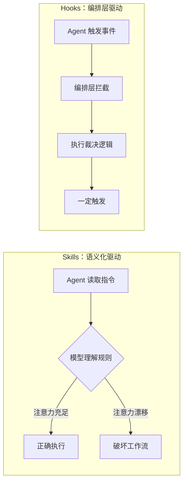
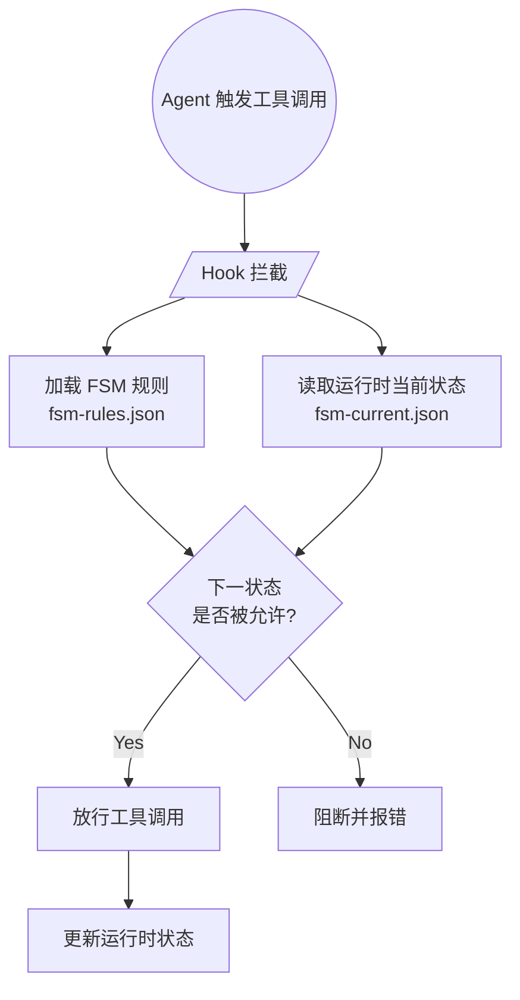

# 1. 问题：Skills 工作流的不确定性

我把软件开发中的一些典型场景抽象成**工作流**，并用 Claude Code（下文简称 CC）的 **skills 机制**实现了自动化——我只需要负责"触发"和"验收"，剩下的重复性工作全部交给 agent。

然而，前一阵子我一直被一个问题困扰：

> **明明我已经在 skills 中明确定义了工作流状态间的流转细节和规则，但在多次测试中，CC 偶尔仍会忘记规则，导致工作流被破坏。**

这种不确定性让我很不舒服——不仅因为失败本身，也因为浪费了大量时间和 tokens。

于是我开始重新思考 skills 到底意味着什么。

# 2. 归因：Skills 的能力边界

## 2.1 被忽视的消极面

在技术社区里可以看到很多关于 skills 的讨论，比如：skills 能够教会 agent 使用工具连接外部世界；相比于 MCP 注意力更集中、更节省 tokens 等。

Anthropic 以及 OpenAI 也是一样，在描述自家 skills 机制时都在强调它的多种优势。

**对工程师而言，评估一项新技术不能只看到它的积极面，它的消极面对于工程化而言同样重要。**

## 2.2 Skills 的执行取决于模型注意力

我想我现在就遇到了 skills 的短板造成的问题。这里可以明确一个事实：

> **Skills 并没有单独的机制来保证工作流中的每一步都按规则执行——它的执行效果完全取决于模型的智力（或者注意力）。**

## 2.3 高自由度任务 vs 低自由度任务

为了把问题说清楚，这里引入两个概念来区分不同类型的 agent 任务：

- **高自由度任务**：目标明确但路径灵活，依赖 agent 的推理能力解决单步内部问题（例如：写一个函数、分析一段日志）。
- **低自由度任务**：状态明确、流程明确、规则明确，需要严格的"重复一致性"（例如：code review、提交 PR、发布流程）。

对低自由度任务而言，skills 的执行效果会随着模型降智而放飞自我，这是不可接受的。

而一个完整的工作流任务，往往**同时包含**两类子任务——既需要利用 agent 的"高自由度"推理能力解决单个流程内部的复杂问题，又需要处理好"低自由度"的流程之间转换规则。

# 3. 方案：用 hooks 锚定状态流转

## 3.1 Hooks 与 Skills 的机制差异

幸运的是，agent 框架的设计者为我们留了另一个工具用于处理"低自由度任务"：**hooks**。

顾名思义，hooks 机制可以让我们定义一些"钩子"，这些钩子会在工作流中的特定位置被调用，从而保证工作流中的每一步都按照规则执行。

区别于 skills 的语义化驱动（由 agent 进行自然语言理解），hooks 源生于 agent 内部，由编排层的策略机制驱动，可以添加在 agent 运行过程中的多个节点上。因此它的特点就是**稳定、可靠、一定会触发**。

两者的差别可以用下图直观对比：

## 3.2 基于 FSM 的 hooks 改造流程

于是我尝试用 hooks 机制来改造原本的 skills 工作流，具体做法分为四步：

- **Step 1 · 抽象 FSM**：把原本 skills 中的**所有状态节点**抽象成有限状态机（FSM），为每个状态编号，定义清楚状态的描述、允许流转的下一个状态以及是否允许跳过当前阶段等。
    - 产物：`fsm-rules.json`（**静态规则**，持久化到 skills 中）
- **Step 2 · 定义运行时变量**：用一个文件表示"当前状态"，skills 运行时创建、结束后销毁。
    - 产物：`fsm-current.json`（**运行时状态**）
- **Step 3 · 编写 hook 裁决逻辑**：hook 被触发时，比对上述两个 JSON 文件，做出**"下一个状态是否能够流转"**的裁决。
- **Step 4 · 配置 hook 触发点**：在 agent 配置文件中定义 hooks 的触发条件，例如"在每次调用工具前触发"。

改造后的工作流在每次工具调用前都会经过 hook 拦截并裁决：

## 3.3 实践效果

这个机制实现上并不复杂，但**在稳定性上带来了质变**——因为 hooks 的触发条件是**完全可控的**，不会像 skills 那样受到模型智力（或注意力）的影响。

**在后来两周的实验中，再也没有出现过 agent 破坏工作流的情况。**

# 4. Takeaway

最后留几条在实践中的经验总结：

- **找到"低自由度任务"**：一旦任务具有状态明确、流程明确、规则明确的特征，就应该把约束下沉到 hooks 层，而不是指望 skills 自己约束自己。
- **Skills 负责语义，Hooks 负责约束**：前者利用模型的理解力处理开放问题，后者利用编排层的确定性守住规则红线，两者互补而非替代。
- **"静态规则 + 运行时状态"分离**：`fsm-rules.json` 只读、`fsm-current.json` 可写，职责清晰，便于 debug 和复用。